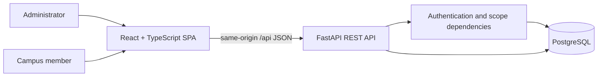

# Technical Design Document (TDD)

**Product:** Campus Lost & Found Management System  
**Version:** 1.0  
**Status:** Proposed design for the course-project baseline  
**Task issue:** [#2 — Add project PRD, SRS, and TDD documentation](https://github.com/Ishmam2222/Campus-Lost-Found-Management-System/issues/2)  
**Pull request:** Pending

## 1. Purpose and implementation status

This document describes a proposed technical design for implementing the
requirements in the accompanying [PRD](PRD.md) and [SRS](SRS.md). The
repository currently has a FastAPI entry point with health and hello examples
and a React/TypeScript/Vite frontend. Authentication, persistence, reports,
claims, and moderation described below are planned work, not existing
functionality.

## 2. Technology and architecture

- **Frontend:** React, TypeScript, Vite, browser `fetch` for REST calls.
- **Backend:** Python 3.10+, FastAPI, Pydantic request and response schemas.
- **Persistence:** PostgreSQL relational database, accessed through SQLAlchemy
  2.x and Alembic migrations.
- **Authentication:** Short-lived signed JWT access tokens; passwords hashed
  using Argon2id through a maintained password-hashing library.
- **Hosting:** Existing Vercel configuration routes `/api/*` to the FastAPI
  service and other paths to the Vite frontend.



The browser calls relative `/api` URLs. Vite proxies these requests to the
local FastAPI development server; production routing is handled by Vercel.
The API is the trust boundary: frontend route guards improve usability but
never replace backend authorization.

## 3. Proposed backend organization

The existing `backend/main.py` remains the application entry point. As features
are implemented, split responsibilities into modules following this shape:

```text
backend/
  main.py                 # Create FastAPI app; register routers and middleware
  api/
    routes/
      auth.py             # Registration, login, current account
      items.py            # Report list, detail, creation, and owner actions
      claims.py            # Claim creation and review
      admin.py             # Moderation and administrative operations
  core/
    config.py              # Validated environment configuration
    security.py            # Password hashing, token creation, scope checks
  db/
    session.py             # Engine and request-scoped database session
    models.py              # SQLAlchemy models
  schemas/
    auth.py
    items.py
    claims.py
  services/
    items.py               # Business rules and ownership-aware operations
    claims.py
  tests/
```

Routers handle HTTP concerns, schemas validate external data, services enforce
workflow rules, and database models represent persisted state. Avoid placing
authorization policy only in React components or route handlers duplicated
across endpoints.

## 4. Data model

### Account

| Field | Type | Notes |
| --- | --- | --- |
| `id` | UUID | Primary key |
| `email` | String | Normalized, unique, indexed |
| `password_hash` | String | Argon2id hash; never returned by API |
| `role` | Enum | `member` or `admin`; assigned by trusted administration |
| `is_active` | Boolean | Disabled accounts cannot authenticate |
| `created_at` | Timestamp | UTC |

### ItemReport

| Field | Type | Notes |
| --- | --- | --- |
| `id` | UUID | Primary key |
| `owner_id` | UUID | Foreign key to `Account` |
| `kind` | Enum | `lost` or `found` |
| `title` | String | Required, bounded length |
| `description` | Text | Required; plain text |
| `category` | String or enum | Search/filter field |
| `location` | String | General campus location; no precise personal location |
| `occurred_at` | Date, nullable | User-supplied event date |
| `status` | Enum | `open`, `resolved`, or `archived` |
| `created_at`, `updated_at` | Timestamp | UTC |

### Claim

| Field | Type | Notes |
| --- | --- | --- |
| `id` | UUID | Primary key |
| `report_id` | UUID | Foreign key to a `found` report |
| `claimant_id` | UUID | Foreign key to `Account` |
| `details` | Text | Private identifying details; bounded length |
| `status` | Enum | `pending`, `approved`, `rejected`, or `withdrawn` |
| `reviewed_by` | UUID, nullable | Account that reviewed the claim |
| `created_at`, `updated_at` | Timestamp | UTC |

### AuditEvent

Record administrative and moderation actions with an event ID, actor account,
action, target type and ID, timestamp, and minimal non-sensitive metadata.
Do not copy passwords, tokens, or full claim descriptions into audit records or
application logs.

Foreign keys and database constraints enforce relationships. Service-layer
checks enforce valid lifecycle transitions, report ownership, and claim policy.
The exact duplicate-claim policy should be confirmed during implementation;
the initial design should prevent duplicate active claims from the same member
for the same report.

## 5. REST API design

All endpoints use the `/api` prefix and JSON unless noted. Exact response
schemas should be implemented as typed Pydantic models and documented in
OpenAPI.

| Method and path | Access | Purpose |
| --- | --- | --- |
| `GET /api/health` | Public | Deployment health check |
| `POST /api/auth/register` | Public | Create a member account |
| `POST /api/auth/token` | Public | Verify credentials and return an access token |
| `GET /api/auth/me` | `items:read` | Return the authenticated account's safe profile |
| `GET /api/items` | Public read | Paginated report list with filters |
| `POST /api/items` | `items:create` | Create a report for the authenticated user |
| `GET /api/items/{item_id}` | Public read | Return public report details |
| `PATCH /api/items/{item_id}` | `items:update:own` plus owner check | Update an owned report |
| `POST /api/items/{item_id}/close` | `items:close:own` plus owner check | Resolve or archive an owned report |
| `POST /api/items/{item_id}/claims` | `claims:create` | Submit a claim against an open found report |
| `GET /api/items/{item_id}/claims` | Owner or `claims:moderate` | List private claims for the report |
| `PATCH /api/claims/{claim_id}` | Report owner or `claims:moderate` | Approve or reject a claim |
| `POST /api/admin/items/{item_id}/moderate` | `items:moderate` | Apply an administrative moderation action |
| `GET /api/admin/audit-events` | `audit:read` | Read paginated audit records |

For the login endpoint, use FastAPI's OAuth2-compatible token form if needed
for the OpenAPI security scheme, then issue a JSON bearer token response.
Protected requests send `Authorization: Bearer <token>`. Public report
responses use explicit response schemas that omit account email, claims, and
moderation metadata.

Use `201 Created` for resource creation, `204 No Content` where a response
body is unnecessary, `401` for missing or invalid authentication, `403` for
insufficient permission, `404` for unknown or deliberately concealed
resources, `409` for state conflicts, and `422` for request validation
failures. Paginated lists should use a consistent `items`, `total`, `limit`,
and `offset` envelope.

## 6. Authentication and authorization

1. Registration normalizes the email, validates the password, hashes it, and
   creates an account with the fixed `member` role.
2. Login verifies the hash and active-account state. On success, it signs a
   short-lived access token with `sub`, `exp`, and server-derived scopes.
3. A FastAPI dependency validates signature, expiry, subject, and active
   account, then supplies a typed current-account object.
4. Endpoints declare required scopes through FastAPI `Security` dependencies.
   For example, report creation requires `items:create`.
5. Services perform resource-level checks after scope checks. A scope to update
   owned reports does not authorize updates to other users' reports.
6. Role changes take effect in new tokens. For sensitive operations, verify
   the current account role in the database; the short token lifetime limits
   stale-claim exposure.

Initial role mapping:

| Role | Scopes |
| --- | --- |
| `member` | `items:read`, `items:create`, `items:update:own`, `items:close:own`, `claims:create`, `claims:read:own` |
| `admin` | Member scopes plus `items:moderate`, `claims:moderate`, `users:manage`, `audit:read` |

Do not accept role or scope assignments from registration payloads. Keep the
JWT signing key and database URL in environment variables. Do not store access
tokens in `localStorage`; keep the short-lived token in frontend memory for the
initial implementation. This means a page reload requires re-authentication;
a secure refresh-token design can be added later only with rotation,
revocation, and appropriate CSRF protections.

## 7. Frontend design and integration

Organize the frontend around typed API clients and feature components:

```text
frontend/src/
  api/                    # Typed fetch wrapper and endpoint functions
  auth/                   # Auth state, login/register forms, route guards
  components/             # Shared fields, feedback, navigation
  features/
    items/                # Report list, filters, details, create/edit forms
    claims/               # Submit and review claim flows
    admin/                # Moderation views
  App.tsx
  main.tsx
```

The API client should send JSON, attach the in-memory bearer token when
available, parse error responses, and return typed data. Components must
render loading, empty, success, and error states; they must not swallow
network failures. Forms should match backend validation constraints and still
handle backend validation responses as authoritative.

## 8. Security and privacy controls

- Enforce authentication, scopes, and ownership on every protected backend
  operation; default to deny.
- Hash passwords with Argon2id and use constant-time password verification
  provided by a maintained library.
- Use HTTPS in production and never include secrets in source control,
  frontend bundles, logs, or error responses.
- Limit and normalize input lengths; use ORM parameter binding and render
  user-provided descriptions as text.
- Return only public report fields to public endpoints; restrict claims and
  contact details to authorized users.
- Rate-limit registration, login, and claim creation at the deployment or API
  layer before public production use.
- Record moderation actions without logging credentials or private claim
  details.
- Configure allowed origins explicitly if a separate frontend origin is ever
  introduced; do not use wildcard CORS with credentials.

## 9. Configuration and deployment

Required deployment configuration should include a database connection string
and a high-entropy JWT signing key. Validate required configuration at startup,
fail explicitly if it is missing, and keep `.env` files out of version control.
Run Alembic migrations as a controlled deployment step. Configure Vercel
services and rewrites using the repository's `vercel.json`; do not place
database credentials or signing keys in frontend environment variables.

Local development uses the Vite `/api` proxy to `http://localhost:8000`. The
backend exposes interactive API documentation at `/docs` during development.
Production documentation exposure should follow the deployment's security
policy.

## 10. Testing strategy

- **Backend unit tests:** password/token helpers, validation, scope mapping,
  lifecycle rules, and ownership decisions.
- **Backend API tests:** registration and login; public report listing;
  report CRUD; claim lifecycle; admin moderation; 401/403/404 and invalid
  payload responses.
- **Frontend tests:** API client error handling, forms, report filters, loading
  and empty states, and permission-dependent actions.
- **Integration tests:** browser or end-to-end flow from login through report
  creation and claim review against a test database.
- **Build checks:** Python import/lint/test checks and frontend TypeScript
  build; apply database migrations in a clean test environment.

Authorization tests should include a member attempting to use another
member's report ID and a valid user token missing the endpoint's required
scope. Both must fail without modifying data.

## 11. Open design decisions

- Which campus identity proof, if any, is required for registration?
- Should visitors be allowed to browse full public report descriptions?
- What are the retention and deletion rules for closed reports and accounts?
- Which category taxonomy and exact claim state transitions should be used?
- What database hosting and rate-limiting facilities are available in the
  deployment environment?

Resolve these decisions with the course stakeholders before production use.

**Tracking issue:** [#2](https://github.com/Ishmam2222/Campus-Lost-Found-Management-System/issues/2)  
**Documentation pull request:** Pending
